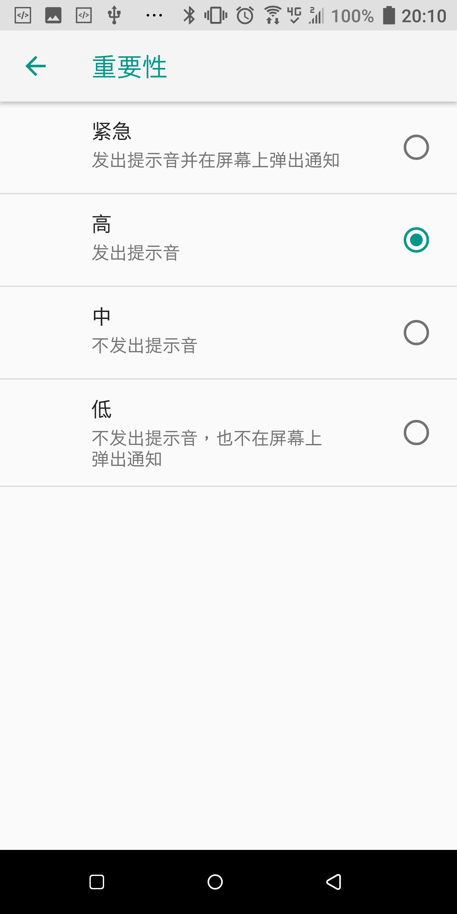

# 在Android Oreo中显示悬浮通知

[toc]

## 背景
最近在工作中遇到这样一个问题：
> 同样的代码从Android 7.0移植到Android 8.0中后本来能弹出的悬浮通知(*Heads-up notifications*)不再显示出来了。

这是怎么回事呢？从Android的更新中也没有提到任何关于悬浮通知的问题。使用百度，google等也没有搜到相关的问题。最终还是在仔细翻阅官方文档后找到了相关思路，并在手机中确认了问题的原因，才得以解决。下面是整个处理过程的记录，分享出来以供参考。

## 官方文档

### API指南
[Android通知的官方文档](https://developer.android.com/guide/topics/ui/notifiers/notifications.html)中可以看到：
> 可能触发浮动通知的条件示例包括：
>* 用户的 Activity 处于全屏模式中（应用使用 fullScreenIntent），或者
>* 通知具有较高的优先级并使用铃声或振动

在我们项目的代码中，目前使用的方式就是设置通知优先级的方式来实现悬浮通知的。该方法在Android　8.0之前一直工作的很好，但是到了Android 8.0之后不能继续工作了，问题只能出在8.0的修改上。此处找不到解决问题的方法。

### setPriority参考手册
[setPriority的参考手册](https://developer.android.com/reference/android/app/Notification.Builder.html#setPriority(int) "setPriority参考手册")中可以看到：
> **This method was deprecated in API level 26.**
> use setImportance(int) instead.

这里提到在API level 26中这个方法被废弃了，转而由这个setImportance方法代替了。那么这个setImportance方法又是怎么一回事呢？

### setImportance参考手册
[setImportance参考手册](https://developer.android.com/reference/android/app/NotificationChannel.html#setImportance(int) "setImportance参考手册")中与setPriority方法的介绍一样简单，并没有提到有关悬浮通知的内容。其可用参数的介绍中同样没有提到悬浮通知相关内容。

遇到死胡同了，虽然参考手册中说要用setImportance方法代替setPriority方法，但是这是悬浮通知不显示的原因么？应该如何才能显示出悬浮通知呢？

## 手机界面中的证据
从文档中没有办法确认了，我不得已换了一个方法。从界面中查找信息。我们知道在**"设置"**-->"**应用和通知**"-->"**通知**"-->"**通知**"在其中找到自己的APP并点击，进入到APP的通知设置界面，选择对应的NotificationChannel点击，会进入到通知类别界面，再次选择"**重要性**"会进入重要性界面。
很好，这里我们找到了与setImportance对应的界面了。从这里我们可以看到重要性有四个级别：
* **紧急**: 发出提示音并在屏幕上弹出通知
* **高**: 发出提示音
* **中**: 不发出提示音
* **低**: 不发出提示音，也不在屏幕上弹出通知

而这里的四个级别跟该方法的可用参数：
> IMPORTANCE_UNSPECIFIED, IMPORTANCE_NONE, IMPORTANCE_MIN, IMPORTANCE_LOW, IMPORTANCE_DEFAULT or IMPORTANCE_HIGH.

从界面中可以看到在紧急时就可以在屏幕上弹出通知。测试后可以确认**当手动修改重要性为紧急后，即可弹出悬浮通知**。

## 结论
至此我们知道了项目在Android　Oreo中不能显示悬浮通知的原因是：
* setPriority　方法被弃用，它所设置的优先级也同时不在起作用
* setImportance　用来替换setPriority方法，在将优先级设置为IMPORTANCE_HIGH/IMPORTANCE_MAX时即可

**注：在写这篇文章时，同时查看了英文版文档，在其中就提到了在Android Oreo及以上中需要使用setImportance方法来显示悬浮通知.**
> Examples of conditions that may trigger heads-up notifications include:
> * The user's activity is in fullscreen mode (the app uses fullScreenIntent).
> * The notification has high priority and uses ringtones or vibrations on devices running Android 7.1 (API level 25) and lower.
> * The notification channel has high importance on devices running Android 8.0 (API level 26) and higher

**从这里可以知道，中文文档更新是有延迟的，以后还是尽可能查看英文文档才是。**

最后放上Android Oreo激萌动画给大家欣赏：

