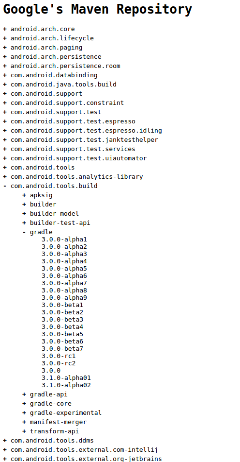

# 在命令行编译AndroidStudio 3.0的项目

[toc]

## 背景
在实际使用中，我们难免会遇到使用命令行来编译Android工程的情况，比如CI服务器等。而我目前所面临的尴尬情况是，家里笔记本配置太低，无法运行AndroidStudio，而不得不通过命令行的方式来临时编译代码。

本来在升级AndroidStudio 3.0之前一直用的很好，毕竟AndroidStudio本来就是通过调用gradle wrapper来进行编译的。但是在升级3.0之后，再次使用命令行编译代码时出现了问题。

遇到问题，解决问题，这是程序员之道。经过一些搜索和查询资料之后，终于解决了这次的问题，并将结论记录如下。

## 问题
在升级AndroidStudio 3.0之前一直在尝试自己做着一个项目，然后在AndroidStudio提示可以升级3.0版本之后，升级了3.0的版本。在重启AndroidStudio之后提示将原有项目升级到3.0版本，确认之后成功完成项目从2.3到3.0的升级。
之后在AndroidStudio中编译开发都是正常的，也并没有在意什么。然而在回家同步代码之后，在命令行再次编译代码时出现编译错误，错误提示如下：
```
* What went wrong:
A problem occurred configuring root project 'DSConnect'.
> Could not resolve all files for configuration ':classpath'.
   > Could not find com.android.tools.build:gradle:3.0.0.
     Searched in the following locations:
         https://jcenter.bintray.com/com/android/tools/build/gradle/3.0.0/gradle-3.0.0.pom
         https://jcenter.bintray.com/com/android/tools/build/gradle/3.0.0/gradle-3.0.0.jar
     Required by:
         project :
```

## 分析
从错误信息来看，Android编译用的gradle插件的3.0.0版本在[jcenter Maven仓库](https://jcenter.bintray.com/ "jcenter Maven仓库")中无法找到。在浏览器中打开jcenter Marven库的网址，在其中查找Android　gradle插件的3.0版本。这是怎么回事呢？

1. 切换为3.0.0版本gradle插件是AndroidStudio自动完成的，应该不是因为版本号错误导致无法找到
2. 在AndroidStudio中编译可以成功，说明AndroidStudio是可以找到这个插件的

### Android官方文档说明
在Android官方文档的[Add Build Dependencies](https://developer.android.com/studio/build/dependencies.html#google-maven)中有介绍，下面这部分库将会放在[Google Maven仓库](https://maven.google.com/ "Google Maven仓库")中：

* [Android Support Library](https://developer.android.com/topic/libraries/support-library/index.html)
* [Architecture Components Library](https://developer.android.com/topic/libraries/architecture/index.html)
* [Constraint Layout Library](https://developer.android.com/training/constraint-layout/index.html)
* [Android Test Support Library](https://developer.android.com/topic/libraries/testing-support-library/index.html)
* [Databinding Library](https://developer.android.com/topic/libraries/data-binding/index.html)
* [Android Instant App Library](https://developer.android.com/topic/instant-apps/index.html)
* [Google Play services](https://developers.google.com/android/guides/setup)
* [Firebase](https://firebase.google.com/docs/android/setup)

要使用这些库，要使用这些库只需要在项目的顶级`build.gradle`文件中加入下面的代码：
```
allprojects {
    repositories {
        google()

        // If you're using a version of Gradle lower than 4.1, you must instead use:
        // maven {
        //     url 'https://maven.google.com'
        // }
        // An alternative URL is 'https://dl.google.com/dl/android/maven2/'
    }
}
```
从这里，我们了解到Google将部分新的依赖库放到了自己的Marven仓库中了，这是我们去[Google Maven仓库](https://maven.google.com/ "Google Maven仓库")中可以发现**com.android.tools.build.gradle.3.0.0也在这个库中**。


### AndroidStudio新建项目对比
AndroidStudio新建项目的情况会怎么样呢，带着这个疑问，在AndroidStudio 3.0中新建一个新的项目，之后发现它的顶级`build.gradle`文件内容如下：
```
// Top-level build file where you can add configuration options common to all sub-projects/modules.

buildscript {

    repositories {
        google()
        jcenter()
    }
    dependencies {
        classpath 'com.android.tools.build:gradle:3.0.0'


        // NOTE: Do not place your application dependencies here; they belong
        // in the individual module build.gradle files
    }
}

allprojects {
    repositories {
        google()
        jcenter()
    }
}

task clean(type: Delete) {
    delete rootProject.buildDir
}
```
从这里可以看到，AndroidStudio在新创建的项目中添加了对[Google Maven仓库](https:maven.google.com/ "Google Maven仓库")的引用。

因此分析认为：
**Google新的Android gradle插件发布到了[Google Maven仓库](https:maven.google.com/ "Google Maven仓库")中，而不在发布到[jcenter Maven仓库](https://jcenter.bintray.com/　"Jcenter Maven仓库")中了，因此要想使用3.0以上版本的gradle插件，必须在`build.gradle`中添加对[Google Maven仓库](https:maven.google.com/ "Google Maven仓库")的引用。**

### 验证分析
参考AndroidStudio新工程的`build.gradle`脚本设置，分别在`buildscrip.repositories`和`allprojects.repositories`中添加`google()`行，增加对[Google Maven仓库](https:maven.google.com/ "Google Maven仓库")的引用。之后编译果然成功了。

**新的疑问:**
既然在必须在`build.gradle`文件中添加对Google Maven仓库的依赖才能编译通过，为什么在添加之前就可以通过AndroidStudio成功编译呢？

由于在命令行中编译无法成功，而在AndroidStudio中可以编译成功，因此原因一定是出在了AndroidStudio当中。查看AndroidStudio的程序目录，我们可以发现如下路径：
```
$AndroidStudio-Root/gradle/m2repository/com/android/tools/build/gradle/3.0.0/
```
很明显，这就是编译是所需要的gradle插件，AndroidStudio已经将它下载到本地了，因此可以直接找到。

为了验证这一观点，我将这个目录重命名成了其他的名称，再次在AndroidStudio中编译原来的项目，结果出现了编译失败的情况。出错信息与在命令行编译时类似。因此可以确认**在AndroidStudio中编译代码时，会默认去`$AndroidStudio-Root/gradle/m2repository/com/android/tools/build/gradle/3.0.0/`这个路径下查找所依赖的库**。

## 结论
1. **Google将新的Android gradle插件发布到了[Google Maven仓库](https:maven.google.com/ "Google Maven仓库")中，而不在发布到[jcenter Maven仓库](https://jcenter.bintray.com/　"Jcenter Maven仓库")中了，因此要想使用3.0以上版本的gradle插件，必须在`build.gradle`中添加对[Google Maven仓库](https:maven.google.com/ "Google Maven仓库")的引用。**
2. **在AndroidStudio中编译代码时，会默认去`$AndroidStudio-Root/gradle/m2repository/com/android/tools/build/gradle/3.0.0/`这个路径下查找所依赖的库**。
3. 对于导入的旧版本项目没有在`build.gradle`文件中加入对Google Maven仓库的引用，这应该是一个bug，因为新建项目就不会出现这个问题。
