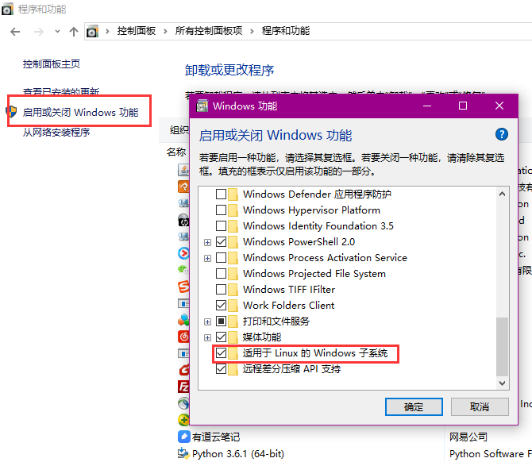

# 在windows 10上通过Linux子系统进行Android开发

[TOC]

## 背景

换了新工作, 忙了很多, 好久没有更新了. 最近因为测试电脑不够用, 以及希望在春节假期期间学习一下CTS框架相关代码, 因此考虑在自己的办公电脑上配置Linux环境. 考虑了下面三个配置方式:

* **删除Windows将电脑重装为Linux** : 这是最简便易用的方法, 但是公司用的办公软件很多只有Windows版本, 将对于开发之后的日常工作造成严重影响.
* **安装Linux虚拟机** : 这样可以完美解决Linux与Windows环境共存的问题, 但同时造成了资源的严重浪费, 虚拟机需要分配较多资源, 但是在使用中并不会完全使用,  而办公用的笔记本配置毕竟有限.
* **使用Linux子系统** : 这样可以显示Linux与Windows环境的共存, 同时避免资源的浪费

综合考虑上述三种方案之后, 最终选择了使用Windows Linux子系统(WSL)的方案.

## 安装Linux子系统(WSL)

在Windows 10一周年版本中开始支持Linux子系统功能, 因此目前的Windows版本基本上都支持了该功能. 但是这个功能目前并不是默认打开的, 需要首先通过如下方法打开wsl功能才能使用.

### 打开Linux子系统功能

1. 首先, 打开"控制面板"并单击其中的"程序和功能"项. 如下图所示:   
2. 在"程序和功能" 窗口左侧导航栏中点击"启用或关闭 Windows 功能", 会弹出如下"Windows 功能"面板, 如下图所示 :   
3. 在弹出的"Windows 功能"面板中找到"适用于Linux 的 Windows 子系统", 并在前面的复选框中点击选中. 如上图所示.
4. 点击"确定"按钮, 按提示完成重启, 中间需要重启多次, 请耐心等待. 重启完成后可以再次打开面板确认该功能已经打开即可.

### 安装Linux发行版

1. 首先按下"ctrl + S"组合键唤出小娜的搜索框, 并在搜索框中搜索并打开"应用商店", 如下图所示 :   
2. 在打开的"应用商店中搜索"Linux", 能够找到很多Windows WSL支持的Linux发行版, 如下图所示 :   
3. 选择自己要用的发行版, 这里我选择的是Ubuntu 18.04 LTS. 点击之后会进入相应的详情页面, 里面点击安装按钮, 即可安装完成.  

至此, Ubuntu 子系统即已安装完成, 其界面如下 :   

### 打开bash

在安装完成后可以在所有程序中找到`Ubuntu 18.04	`的菜单项, 打开后就会进入Ubuntu 子系统的bash界面. 如下所示 :  

此时即可在bash中输入linux相关命令, 进行操作了.

### 第三方终端推荐

目前来说, Windows终端软件还是存在不少缺陷, 下面推荐一款第三方终端软件供大家选择使用:

* [cmder](http://cmder.net/) : cmder是一个Windows上的终端软件, 可以完美的替代Windows内置的命令行, 并且增强了很多功能. 其中最重要的是, cmder 内置了对wsl的支持.  我们可以在cmder里直接打开连接到WSL的标签.

## 下载和编译AOSP源码

下载和编译AOSP源码与在Ubuntu 18.04真机上并没有本质区别, 只是存在如下一些点需要注意:

* 下载位置 : 由于AOSP代码已经很大(*目前看要想编译成功至少需要200G空间*), 而默认的home目录是在Windows的系统盘中虚拟出来的.  因此如果直接将代码放在home目录下的话, 需要c盘有200G以上的剩余空间. 而一般Windows的系统盘, 大家都不会准备太大. 因此, 建议大家**将代码下载到windows的其他磁盘驱动器**
* 大小写敏感 : Windows系统本身是不支持大小写敏感的. 而AOSP却要求必须大小写敏感. 因此必须首先通过命令`fsutil.exe file setCaseSensitiveInfo C:\folder enable`打开对应目录的大小写敏感功能. 同时由于该命令对于已经存在的子目录并不其效果,  所以必须**先设置目录大小写敏感, 再开始下载代码**
* 在编译Android时, 需要设置`export JAVA_TOOL_OPTIONS=-Dfile.encoding=UTF8`以便能够正确的编译java代码.

## 访问adb设备

由于WSL中并没有访问usb设备的权限. 因此要想在WSL中访问adb设备, 必须首先在Windows命令提示符窗口中首先运行一次`adb`命令来打开adb server进程, 并确认在Windows中已经可以访问adb设备了. 

然后再在WSL中执行`adb devices`命令来确认是否已经可以正常访问adb设备了.